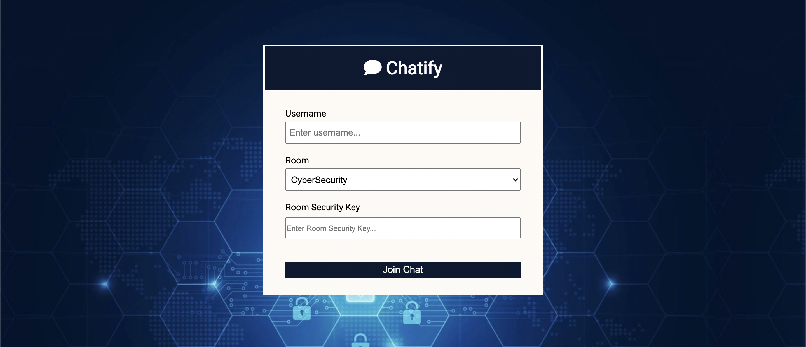
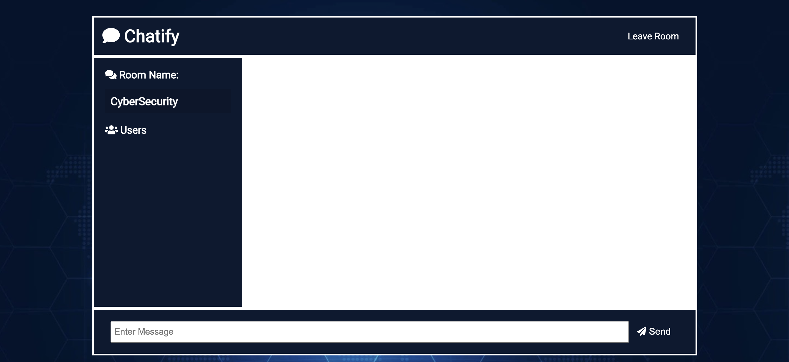

# End To End Encrypted Secure Chat Application
> This is a secure chat application made using node and socket.io
<!-- > Live demo [_here_](https://www.example.com). If you have the project hosted somewhere, include the link here. -->

## Table of Contents
* [General Info](#general-information)
* [Technologies Used](#technologies-used)
* [Features](#features)
* [Screenshots](#screenshots)
* [Setup](#setup)
* [Usage](#usage)
* [Project Status](#project-status)
* [Contact](#contact)
<!-- * [License](#license) -->

## General Information
- With continuously increasing technology, as well as new chating applications emerging every now and then, we wanted to learn about security aspects of these applications and also about the cryptographic encryption and decryption processes
- This app has different rooms for different subjects and users can log into these rooms with passwords and chat with each other securely and in realtime
<!-- You don't have to answer all the questions - just the ones relevant to your project. -->

## Technologies Used
- Node, Express
- HTML/CSS/Bootstrap
- MongoDB
- Socket.io

## Features
- This project uses socket.io for real time end to end encryption
- App has different rooms as per the subjects and users can chat in these rooms in real time
- Cryptographic implementations for storing passwords as well as end to end encryption

## Screenshots

<!-- If you have screenshots you'd like to share, include them here. -->

## Setup
MongoDB server should be started at port 27017
Initialize npm to download required files

## Usage
After setup,
`node server.js` does the work.

## Project Status
Project is: _Complete_ 

## Contact
Created by [Shriram Pareek](https://github.com/Shrirampareek888), [Kishan Partani](https://github.com/KishanPartani), [Tejas Pradhan](https://github.com/tejaspradhan), [Aditya Pangaonkar](https://github.com/Adi306) and [Balaji Padamwar](https://github.com/balaji1608) - feel free to contact us!

<!-- Optional -->
<!-- ## License -->
<!-- This project is open source and available under the [... License](). -->

<!-- You don't have to include all sections - just the one's relevant to your project -->
